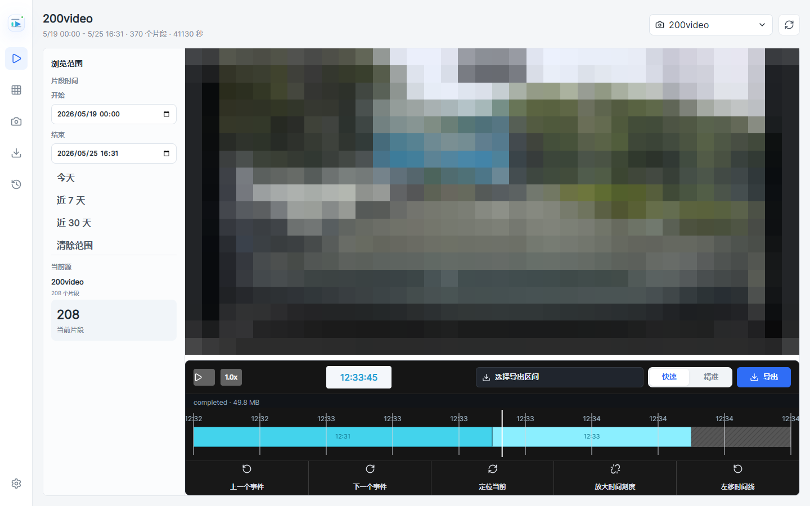
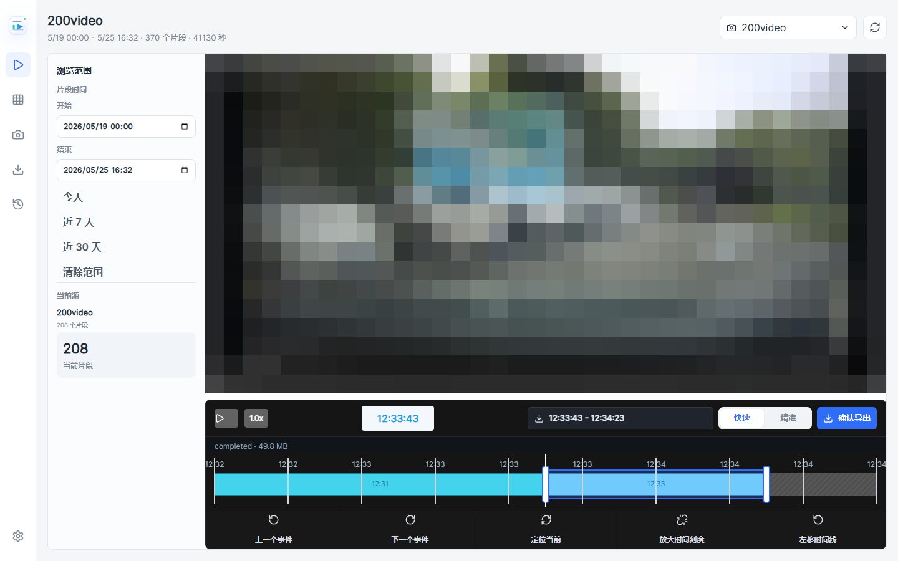
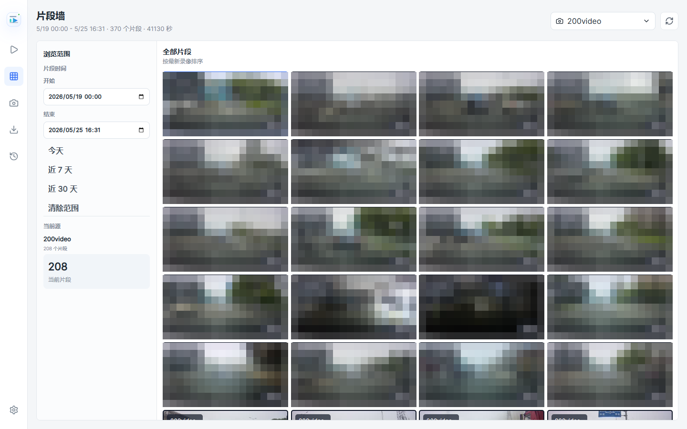
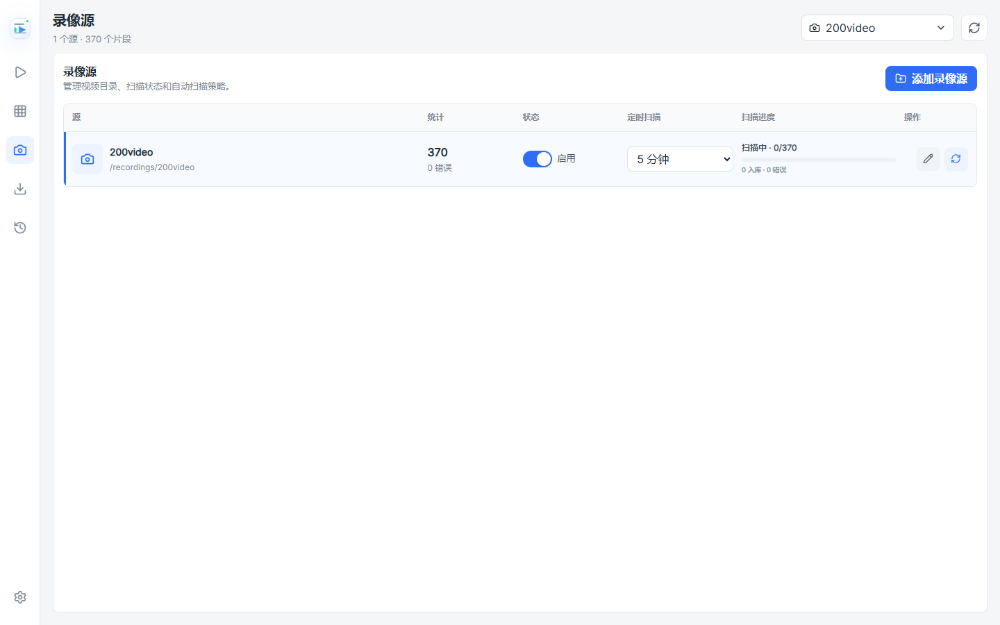

# Clipline

Clipline 是一个本地录像片段回放和导出工具，面向行车记录仪、监控录像、执法记录仪等按片段保存的视频目录。它会扫描录像源目录，建立片段索引，生成缩略图，并提供视频回放、时间线定位、片段墙浏览和区间导出。

## 界面预览

### 录像回放

视频和时间线位于同一工作区内，选择片段后会自动定位到对应时间段。



### 时间线导出区间

点击“导出”后才显示导出滑块，拖动左右把手选择时间区间，再点击“确认导出”创建后台任务。



### 片段墙

按录像时间倒序展示片段缩略图，适合快速浏览和切换片段。



### 录像源管理

管理视频目录、启停扫描、配置定时扫描间隔，并查看扫描进度。



## 核心能力

- 录像源管理：添加本地或 Docker 挂载目录，启用或停用扫描。
- 自动扫描：使用 FFmpeg/ffprobe 读取视频元数据，保存片段索引。
- 缩略图：为片段生成缩略图，片段墙可快速识别内容。
- 回放时间线：视频播放时间和时间线光标同步，选择片段后自动缩放定位。
- 区间导出：在时间线上通过滑块选择导出范围，支持快速和精准两种模式。
- 后台任务：确认导出后创建任务，完成后提示下载，不打断当前回放页面。
- 状态与日志：提供系统状态、扫描任务、导出任务和错误信息。
- Docker 优先：生产验证以 Docker 容器为主，前后端打包到同一个镜像。

## 快速启动

### 1. 准备视频目录

将录像文件放在一个固定目录下，例如：

```powershell
C:\Users\EvanQ\Desktop\200video
```

如果使用自己的目录，请同步修改 `docker-compose.yml` 中的挂载路径：

```yaml
volumes:
  - ./data:/app/data
  - C:/your/video/folder:/recordings/video1:ro
```

容器内路径 `/recordings/video1` 会在 Clipline 中作为录像源路径使用。

### 2. Docker Compose 启动

```powershell
docker compose up -d --build
```

默认访问：

```text
http://127.0.0.1:8080
```

当前本机调试也可以使用手动映射到 `28080`：

```powershell
docker build -t clipline-clipline:latest .
docker rm -f clipline
docker run -d --name clipline --restart unless-stopped `
  -p 28080:8080 `
  -v "${PWD}\data:/app/data" `
  -v "C:\Users\EvanQ\Desktop\200video:/recordings/200video:ro" `
  -e TZ=Asia/Shanghai `
  clipline-clipline:latest
```

访问：

```text
http://127.0.0.1:28080
```

### 3. 添加录像源

进入“录像源”页面，点击“添加录像源”，填入：

```text
名称：200video
路径：/recordings/200video
```

添加后可以手动点击扫描，也可以启用定时扫描。

## 使用流程

1. 启动 Docker 服务。
2. 在“录像源”中添加容器内的视频目录。
3. 等待扫描完成，片段会进入索引。
4. 在“录像回放”中选择源和片段。
5. 使用时间线定位当前播放点，或切换上一个、下一个事件。
6. 点击“导出”显示导出区间滑块。
7. 拖动左右滑块选择范围。
8. 选择“快速”或“精准”模式。
9. 点击“确认导出”创建后台导出任务。
10. 导出完成后根据提示下载文件，或进入“导出任务”查看历史。

## 导出模式

| 模式 | 说明 | 适用场景 |
| --- | --- | --- |
| 快速 | 尽量不重新编码，导出速度更快，边界可能贴近关键帧 | 临时取证、快速分享、长片段导出 |
| 精准 | 重新编码，起止时间更准确，但速度更慢 | 对起止点要求更高的短片段 |

## 配置项

服务通过 `CLIPLINE_` 前缀读取环境变量。

| 变量 | 默认值 | 说明 |
| --- | --- | --- |
| `CLIPLINE_PORT` | `8080` | 后端监听端口 |
| `CLIPLINE_DATA` | `/app/data` | 数据目录 |
| `CLIPLINE_DB` | `/app/data/clipline.db` | SQLite 数据库路径 |
| `CLIPLINE_RECORDINGS_ROOT` | `/recordings` | 可浏览的录像根目录 |
| `CLIPLINE_RECORDINGS_ROOTS` | 空 | 多个录像根目录，使用英文逗号分隔 |
| `CLIPLINE_SCAN_INTERVAL_SECONDS` | `300` | 调度器扫描间隔 |
| `CLIPLINE_EXPORT_TTL_HOURS` | `24` | 导出文件保留时间 |
| `CLIPLINE_MAX_EXPORT_MINUTES` | `30` | 单次最大导出分钟数 |
| `CLIPLINE_MAX_CONCURRENT_EXPORTS` | `1` | 最大并发导出数 |
| `CLIPLINE_THUMBNAIL_MODE` | `middle` | 缩略图截取策略 |
| `CLIPLINE_TIMEZONE` | `Asia/Shanghai` | 时间显示和扫描时区 |
| `CLIPLINE_SKIP_RECENT_SECONDS` | `30` | 扫描时跳过最近写入的文件，避免读取未写完片段 |
| `CLIPLINE_LOG_LEVEL` | `INFO` | 日志级别 |
| `CLIPLINE_LOG_FILE` | `/app/data/logs/clipline.log` | 日志文件路径 |

## 本地开发

### 后端

```powershell
cd backend
py -m venv .venv
.\.venv\Scripts\Activate.ps1
pip install -e ".[dev]"

$env:CLIPLINE_DATA = "../data"
$env:CLIPLINE_DB = "../data/clipline.db"
$env:CLIPLINE_RECORDINGS_ROOT = "C:/Users/EvanQ/Desktop/200video"
uvicorn app.main:app --reload --host 127.0.0.1 --port 8080
```

### 前端

```powershell
cd frontend
npm install
npm run dev
```

前端开发服务器默认运行在：

```text
http://127.0.0.1:5173
```

`frontend/vite.config.ts` 会把 `/api` 代理到 `VITE_API_TARGET`，默认是：

```text
http://127.0.0.1:8080
```

需要改后端地址时：

```powershell
$env:VITE_API_TARGET = "http://127.0.0.1:28080"
npm run dev
```

## 构建验证

前端构建：

```powershell
cd frontend
npm run build
```

Docker 构建：

```powershell
docker build -t clipline-clipline:latest .
```

服务健康检查：

```powershell
Invoke-WebRequest -UseBasicParsing http://127.0.0.1:8080/api/system/status
```

## API 概览

| 方法 | 路径 | 说明 |
| --- | --- | --- |
| `GET` | `/api/health` | 健康检查 |
| `GET` | `/api/system/status` | 系统状态、数据库、数据目录和统计信息 |
| `GET` | `/api/sources` | 录像源列表 |
| `POST` | `/api/sources` | 创建录像源 |
| `PATCH` | `/api/sources/{source_id}` | 更新录像源 |
| `POST` | `/api/sources/{source_id}/scan` | 手动触发扫描 |
| `GET` | `/api/recording-directories` | 浏览容器内录像目录 |
| `GET` | `/api/scan-jobs` | 扫描任务列表 |
| `GET` | `/api/timeline` | 指定源和日期的时间线 |
| `GET` | `/api/segments` | 片段列表 |
| `GET` | `/api/segments/{segment_id}/stream` | 视频流 |
| `GET` | `/api/segments/{segment_id}/thumbnail` | 片段缩略图 |
| `POST` | `/api/exports` | 创建导出任务 |
| `GET` | `/api/exports` | 导出任务列表 |
| `GET` | `/api/exports/{export_id}/download` | 下载导出文件 |

更完整的接口和数据结构说明见 [docs/API_AND_DB.md](docs/API_AND_DB.md)。

## 目录结构

```text
clipline/
├─ backend/                 # FastAPI 后端、扫描、导出、调度、数据库模型
├─ frontend/                # React + Vite 前端
├─ docs/                    # 产品、技术、接口和截图文档
│  └─ screenshots/          # README 截图
├─ data/                    # 本地数据库、缩略图、导出文件和日志
├─ Dockerfile               # 前端构建 + 后端运行的一体化镜像
└─ docker-compose.yml       # Docker Compose 示例
```

## 技术栈

- 前端：React 19、Vite、TypeScript、TanStack Query、Radix UI、Lucide Icons。
- 后端：FastAPI、SQLAlchemy、SQLite、Pydantic Settings。
- 媒体处理：FFmpeg / ffprobe。
- 部署：Docker 单容器，静态前端由 FastAPI 同进程托管。

## 注意事项

- Docker 中配置的是容器路径，不是 Windows 主机路径。
- 录像目录建议只读挂载，避免服务误改原始文件。
- 扫描会跳过最近写入的文件，避免索引未写完的视频片段。
- 大文件导出会占用 CPU 和磁盘空间，建议根据机器性能调整并发数。
- 如果页面没有加载片段，先确认已经选择录像源，并且该源扫描完成。
